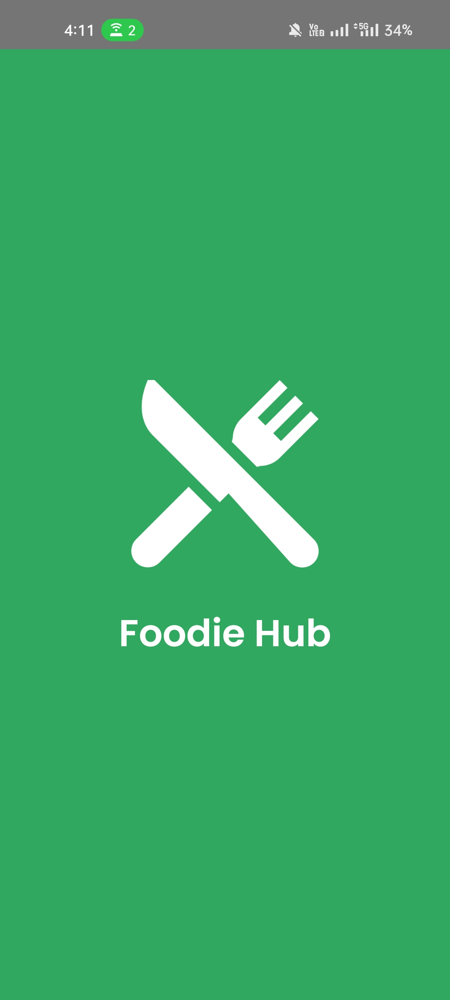
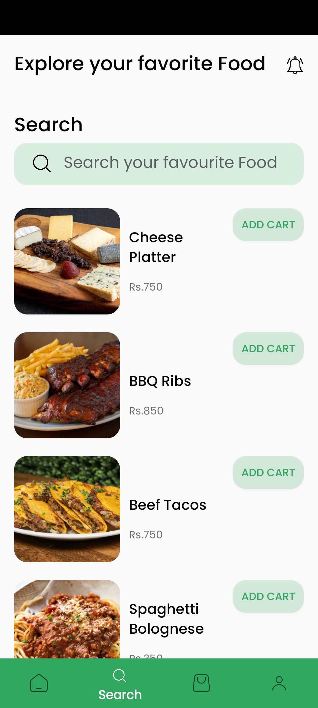

# FoodieHub
FoodieHub is a restaurant food app for Android devices. It provides users with a platform to explore restaurants, view their offers, browse food items, add items to cart, and place orders.

## Features
- Login: Users can log in using their credentials via Firebase Authentication. 
- Signup: New users can create an account using Firebase Authentication and their details are stored in the Realtime Database.
- Home Page: Displays restaurant offer banners and a selection of food items.
- Search Page: Allows users to search for specific food items.
- Food Detail Page: Provides detailed information about a selected food item.
- Cart: Users can add items to the cart, update quantities, remove items, and place orders.
- Profile: Displays user profile details and allows for profile updates.

## Technologies Used
- Architecture: MVVM (Model-View-ViewModel)
- Language: Kotlin
- Layouts: XML
- Backend: Firebase Authentication, Realtime Database
- Concurrency: Coroutines

## Download APP
You can download the latest version of the FoodieHub app from the following link:

[FoodieHub APK](https://drive.google.com/file/d/1VcUVzwX1rnrsjxrqBAhUF6cU9sMsekNk/view)

## Screenshots

